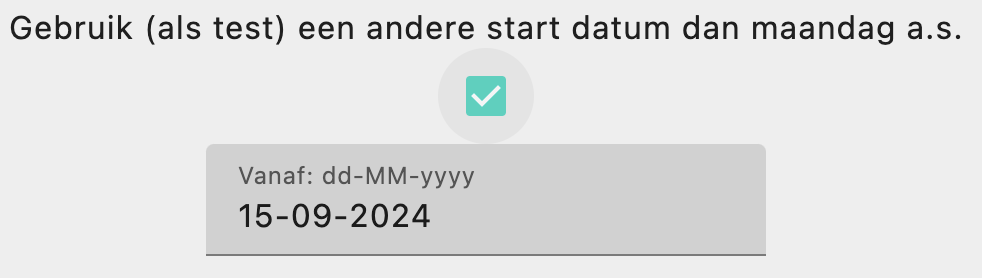
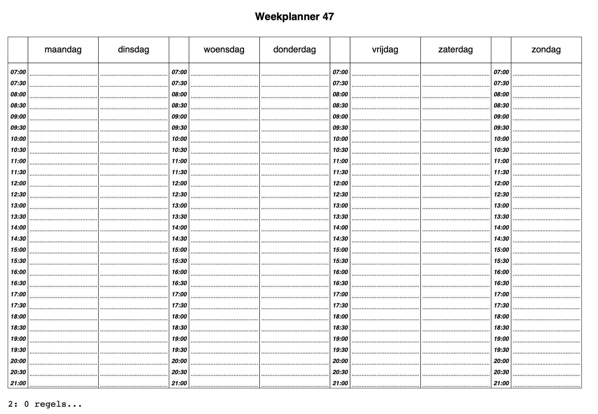
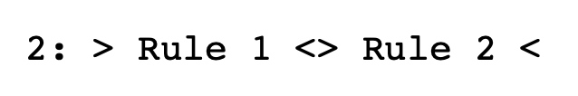
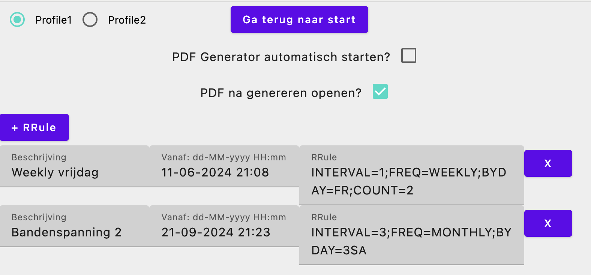
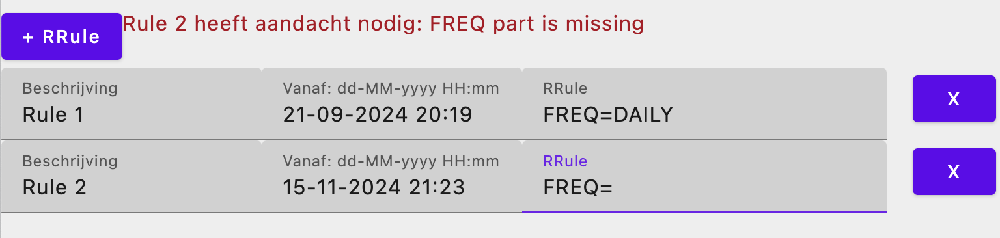

# made-garbanzo-planner
Plan ahead, one entity at a time!

## Motivation
In order to be able to schedule with multiple people, an easy to fill in PDF is what I needed.
Garbanzo was the recommendation of naming the repository by GitHub.

## Features
- Output a PDF with a planner.
- In Dutch language for now (haven't found out multilanguage yet).
- Display next week number.
- Allow Recurrence Rules to be added.
- Shows if recurring rule occurs in current week number.
- Allows testing using manual from date input.
- Available for multiple platforms.
- Two profiles

## Screenshots
Main window allows to switch profile, generate PDF or go to settings. For testing, you can opt in to change the start date from which the next Monday will be picked:

Choose a date to test the Recurrence Rules you entered:

The PDF, a rotated page with swapped A4 width and height:

The suggestion box showing two Recurring rules:

The suggestion box showing an error:

The settings screens, allowing to enter recurrence rules and finetune the application:

The recurrence rule section showing an error. The error will be handled in the planner as text too. The error is piped through from the library that is used to parse the recurrence rules

## Developer notes
Best is to use the pre commit hook for ktlint, otherwise the CI will fail and it is embarassing (: You can "install" it by copying the pre-commit file to the .git/hooks directory or run the gradle task supplied by the root build.gradle.kts.
- Dependency updates gradle > help > dependencyUpdates
